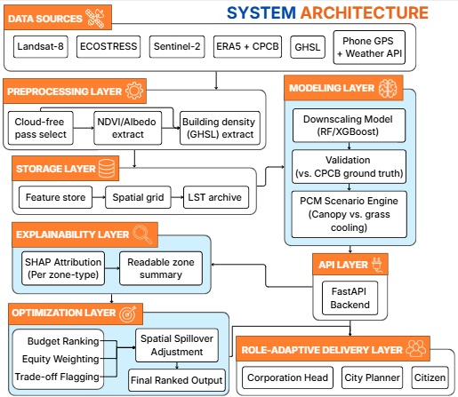
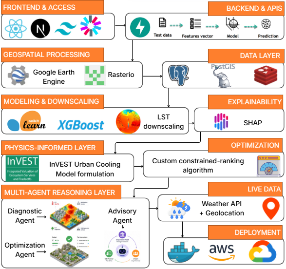
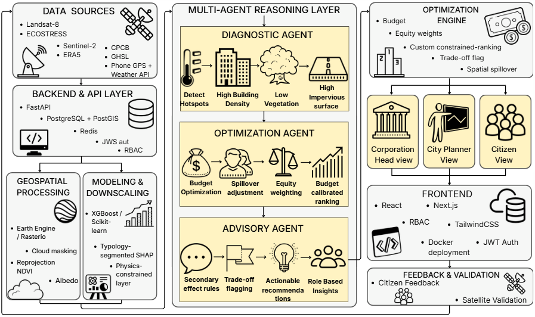

🌡️ Urban Heat Mitigation & Cooling Strategy Optimizer

📌 Problem Statement

Develop a geospatial AI/ML-based system, backed with physics-informed decision making, to identify urban heat stress hotspots, quantify key drivers of urban heating, and generate optimized, scenario-based cooling interventions for mitigating urban heat impacts.

💡 What We Built

An end-to-end AI pipeline that goes beyond heat mapping — bridging the gap between satellite-based diagnosis and real-world, budget-constrained, equity-aware urban planning decisions.

From raw satellite imagery to a role-adaptive decision tool: one pipeline, three stakeholder views, physically grounded recommendations.

🚀 Key USPs

1. Budget-Calibrated Intervention Optimizer

Interventions ranked by ₹ per °C reduction per person benefited. Budget slider dynamically re-ranks the list — a real planning tool for an actual budget meeting, not a static suggestion screen.

2. Equity-Weighted Prioritization Layer

Recommendations weighted by vulnerable population density (elderly, outdoor workers, informal housing) — shifting from "where is it hottest" to "where will cooling save the most lives."

3. Role-Adaptive Decision Layer

One model, three structurally different decision surfaces:

Corporation Head — budget allocation + interactive map simulation
City Planner — diagnostic map + driver breakdown + what-if simulator
Citizen — personal heat exposure + live air temperature + action tips

4. Trade-off-Aware Recommendation Layer

Each intervention flagged with known secondary effects from urban-climatology literature (e.g., humidity rise from added vegetation, reflected heat from cool roofs) — because naive single-metric optimization is insufficient for responsible planning.

🏗️ System Architecture

Layers:

Data Ingestion — Landsat-8 (LST), ECOSTRESS (LST), Sentinel-2 (LULC), ERA5 + CPCB (met/validation), GHSL (building morphology), Phone GPS + Weather API (live air temp)
Preprocessing — Cloud-mask filtering, raster alignment, NDVI/albedo/building-density extraction
Downscaling — RF/XGBoost sharpens 30–70m LST to street-level resolution
Physics-Constrained Modeling — Scenario simulation regularized by heat-transfer physics; tree-canopy and open-grass cooling modeled as separate coefficients
Explainability — SHAP, typology-segmented per urban zone type; output auto-converted to plain-language explanations
Optimization — Budget ranking, equity weighting, spatial spillover adjustment, trade-off flagging
Delivery — FastAPI + React, role-scoped views

🛠️ Tech Stack

LayerStackFrontendReact + Next.js + TailwindCSSBackendFastAPIGeospatialGoogle Earth Engine / RasterioDatabasePostgreSQL + PostGIS, RedisML/ModelingScikit-learn, XGBoost, SHAPPhysics LayerCustom regularization (InVEST UCM formulation)OptimizationCustom constrained-ranking engineLive DataWeather API + GeolocationDeploymentDocker

📊 Data Sources

DatasetSourceUsed ForLand Surface TemperatureLandsat-8, ECOSTRESSBaseline heat mappingLand Use/Land CoverSentinel-2Feature extractionAtmospheric variablesERA5, CPCBModel features + validationBuilding morphologyGHSLDownscaling, driver attributionLive air temperaturePhone GPS + Weather APICitizen real-time view

🔬 Technical Methodology

Downscaling
Coarse satellite LST (30–70m) sharpened to street-level using RF/XGBoost trained on NDVI, LULC, and GHSL building density.

Physics-Constrained Scenario Modeling
Intervention predictions regularized against real heat-transfer relationships (shade, evapotranspiration, albedo, density). Tree-canopy and grass cooling treated as physically distinct coefficients — not one blended "greenery" variable.

Typology-Segmented Attribution
Separate SHAP driver models per urban zone type (dense core / mixed residential / green periphery) instead of one blanket city model, since heat drivers differ structurally between zones.

Spatial Spillover Adjustment
Optimizer accounts for the cooling radius of each intervention to avoid recommending overlapping, redundant placements.

Validation
Model predictions checked against CPCB ground-station temperature readings with transparent error reporting per zone.

👥 Stakeholder Roles

Corporation Head
Budget-constrained planning view. Interactive intervention map with live recoloring as budget is allocated. ROI-per-₹ ranking.

City Planner
Full diagnostic view. Hotspot map, per-zone driver breakdown ("hot because 40% concrete, 25% low canopy"), what-if scenario simulator.

Citizen
Auto-located personal heat exposure. Live air temperature alongside satellite-derived surface heat. Trade-off-aware personal cooling tips.

🔭 Future Scope

Heat Growth Trajectory Forecasting — project ward-level heat stress to 2030 under business-as-usual
Closed-Loop Post-Implementation Verification — validate predicted cooling against the next satellite pass after an intervention is built
Preventive Development Screening — predict heat contribution of proposed new construction before approval
Hyperlocal Sensor Layer — low-cost IoT ground sensors for true real-time street-level readings
Causal Second-Order Effects Engine — move from rules-based trade-off flags to full causal inference (do-calculus) quantifying second-order intervention effects

📄 License

This project was built for the Bharatiya Antariksh Hackathon 2026. All rights reserved by the team.